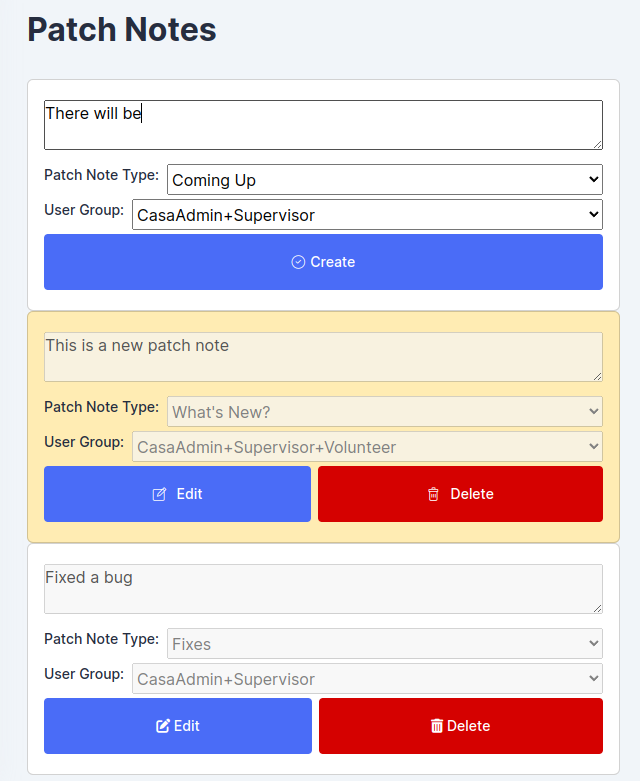
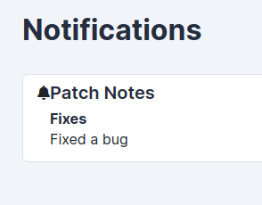
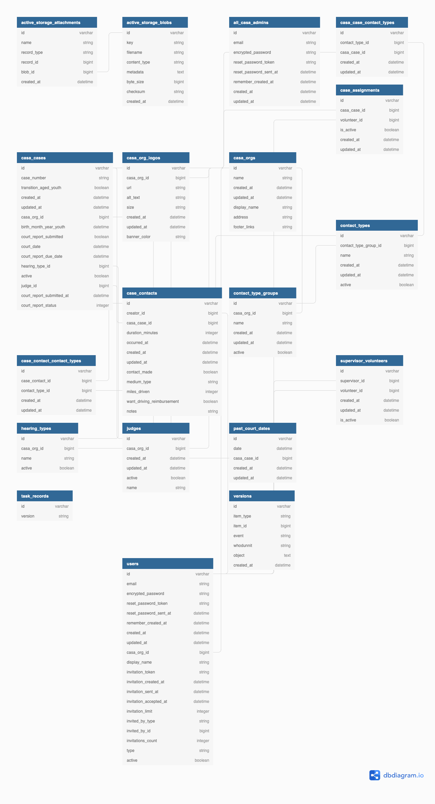
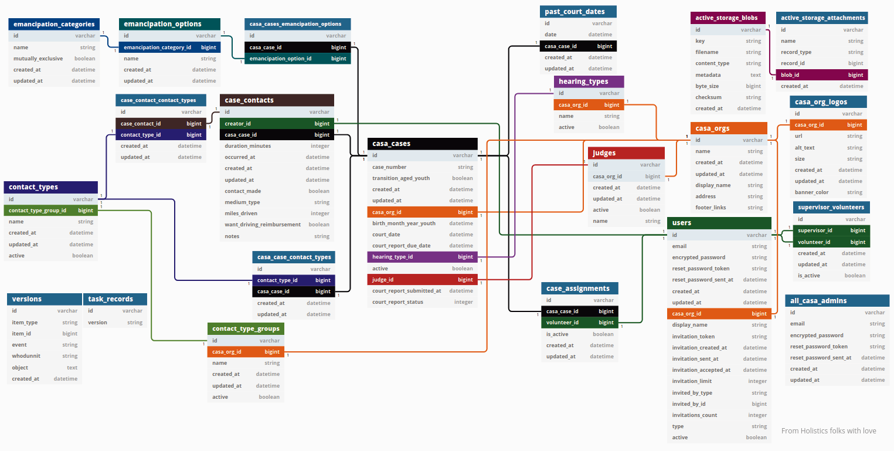
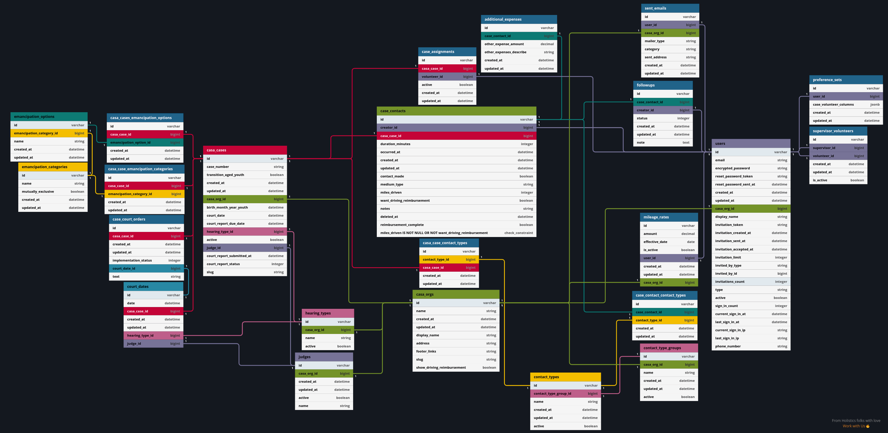
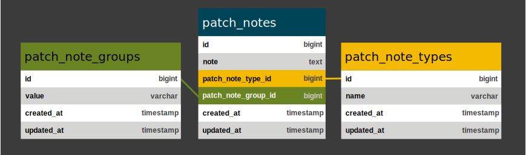

# CASA
## About CASA
CASA or **C**ourt **A**ppointed **S**pecial **A**dvocate is a nonprofit serving children in the foster care system. CASA volunteers help chidren by looking out for the child's best interests while they're in the foster care program. Some examples of what CASA volunteers do include making sure the child they look after is doing well in school and making sure their youth has permanent family connections.
  
## About the App
This casa app is maintained by volunteers from the [RubyForGood](https://rubyforgood.org/) community. RubyForGood maintains this app with the goal of saving money for CASA organizations so it does not charge for app features if it can help it. It serves about 100-200 active monthly users across 4 counties in Maryland.  

[:octicons-mark-github-16: Github repo here](https://github.com/rubyforgood/casa)  
  
### App Summary
The primary functions of this app are to  

 - record work done by the volunteer
 - remind users about upcoming deadlines or events
 - generate reports from data stored in the app

App Specific Terminology

 - **casa case** represents a youth
 - **case contact** represents time spent working on a case. Typically involves contacting a person
 - **emancipaton** the transitioning process for a youth leaving the CASA program
 - **transition** a youth transitioning out of the CASA program

### App Architecture
#### Backend
The main framework for RubyForGood's CASA is ruby on rails. Some major rails dependencies that define the app are:

 - [:octicons-mark-github-16: devise](https://github.com/heartcombo/devise) for all our authentication needs
 - [:octicons-mark-github-16: pundit](https://github.com/varvet/pundit) for controlling access to data
 - [twilio](https://www.twilio.com/) for SMS messaging
 - [rspec](https://rspec.info/) for unit tests
 - [:octicons-mark-github-16: capybara](https://github.com/teamcapybara/capybara) for system tests

 [Postgres](https://www.postgresql.org/) is our database management system.

#### Hosting
The app is hosted on [Heroku](https://dashboard.heroku.com). We have a pipeline where continuous integration builds our quality assurance environment(QA) from the latest updates from our github repo. From QA changes are manually verified and manually deployed to our production environment.

#### Frontend
CASA is a multi page website with [AJAX](https://en.wikipedia.org/wiki/Ajax_(programming)) mixed in. CASA's main javascript framework is [jQuery](https://jquery.com/). Our main styling framework is the [plainadmin theme](https://plainadmin.com/) which is built on top of bootstrap 5. [Sass](https://sass-lang.com/) is used for all styling not provided by plainadmin.

# My CASA Contributions

## Major Features

### Emancipation Checklist
As children leave the CASA program(typically from getting older), CASA volunteers need to make sure their youth(s) are prepared for life. There is a lot to keep track of over a long period of time so they need a checklist to keep track.  

<figure markdown>
  { style="width: 40em" }
</figure>

This was the first feature I made for the project. Unlike the rest of the project at the time, this feature saves to the database via AJAX. At the time, the CSS on the website did not load when javascript was disabled so I assumed the app was javascript reliant. The core maintainers at the time wanted little javascript to make the project easier to maintain.  
  
Everytime a checkbox is clicked, the new state of the form is saved to the database. While the save request is in transit, the checkbox being saved is disabled. If the response indicates the save is successful, the check item is reenabled. If it is unsuccessful, the checkbox is reenabled and reverted to the state it was in before it was clicked. Notifications are shown in the bottom right of the screen.

<figure markdown>
  { style="width: 40em" }
  <figcaption>Here the notifier component is displaying a request is in progress, a different request was recently successful, and the result of the successful request.</figcaption>
</figure>

The concept of a checklist layout wasn't my design. I wanted to go for something more like a kanban board beacuse I felt more websites have it as a solution to address a todo list style problem. I also wanted notes for emancipation categories so users could see why certain items are stuck or not possible to achieve.

### Fixed Overlooked Code After Soft Deletes were Implemented
To meet record keeping requirements all old casa cases and case assignments to volunteers needed to be stored, so instead of deleting casa cases they are marked as inactive and case assignemnts are marked as unassigned. Some sections of code did not support the new changes. The bugs were:

 - A user's list of case contacts included deactivated and unassigned cases
 - Volunteers would be emailed about court reports regarding cases they have been unassigned from
 - A volunteer's list of recently contacted cases included inactive and unasigned cases
 - Checking whether a volunteer contacted all their cases in 2 weeks included inactive and unassigned cases
 - Checking whether a volunteer is assigned to a tranitioning case included inactive and unassigned cases
 - Inactive and unassigned cases were included in the list of volunteers assigned to transitioning cases
 - A supervisor's weekly summary includes cases that have been unassigned from their volunteers

### Added Update Support for the Data Importer
CASA Organizations can upload a CSV file containing cases, volunteers, or supervisors. Before the importer would show an error when an existing record would be imported. This feature made it so an existing record would be updated to match the uploaded CSV.

### Court Reports
The app can fill out a court report using available data from the database. A major challenge in achieving this was working with the gem [sablon](https://github.com/senny/sablon). Sablon is the dependency that fills out a docx template with data. Sablon will not throw errors for code written in templates making troubleshooting difficult. Sablon's documentation primarily features creating templates using XML to construct word documents but casa templates are made by inserting sablon instructions in a sample docx given to us by the stakeholders.  
  
To address some of these challenges, I wrote a [wiki page](https://github.com/rubyforgood/casa/wiki/How-to-edit-docx-templates---word-document-court-report) about working with sablon. It details how to insert sablon code in the word document and contains strategies for creating the template with minimal troubleshooting.  
  
In this area of the app, I have

 - consolidated 2 templates for an organization into a single template
 - added support for a custom template per organization
 - added file uploads for templates
 - created a template for Montgomery county
 - expanded what data each template can display

### Android App
Unfortunately this is an incomplete feature and development has hit a roadblock. The plan was to build the app as a [progressive web app(PWA)](https://web.dev/what-are-pwas/). PWA technology allows us to save time that would be otherwise be spent rewriting the website as an android app by simply extending the webapp. We planned to add push notifications and offline support using PWA technology.

The app store is requiring this app to meet a newer API level. However before the app can be updated, the app is required to conform to the play store's new data privacy policy which includes features like a way for users to request all their data be deleted.  

I had gotten the casa website configured so it runs in an android web container supporting PWAs. The app pings `assetlinks.json` for a cryptographic key so it knows the developers of the CASA website are the same as the developers publishing the mobile app.

This feature required the casa team to keep track of a cryptgraphic certificate like file and the password to the play account. We noticed at this point we had many secrets across many services to manage so to help us stay organized, the casa team created a 1password vault in response to our growing collection.

You can [:material-google-play: find it here](https://play.google.com/store/apps/details?id=org.rubyforgood.casa&pli=1). There's not too much to see at the moment.

### Created Scripts for [git Hooks](https://git-scm.com/book/en/v2/Customizing-Git-Git-Hooks)

[:octicons-mark-github-16: See them here](https://github.com/rubyforgood/casa/tree/main/bin/git_hooks)

These scripts are designed to cut down on the workload from syncing the local project with the remote. When configured like the examples in the readme, local development can be reduced to code, commit, and push; entirely skipping steps like dependency management and keeping the branch updated.

### Github Workflow Management
Github graciously provides very powerful automation tools for free. Any script can be run on their server side git events or on a scheduled interval.

I've helped add 4 workflows that check all code contribution requests for errors and quality. In sum, I'd estimate the total time of configuring these workflows to be less than 4 hours total. The impact of these workflows has easily resulted in hundreds of hours of automated error and quality checks for potential contributions.

The reason setting up the workflows took so little time was because it mostly involved configuring scripts created by open source developers. The casa repo needed a workflow to set labels for it's issues/tickets based on what column in the kanban board they were in. We could not find an existing solution so we had to make our own. A contributor, Brandon, created his own repo for it. Initially, it supported one column and one label. Later as the casa repo's needs grew, the workflow had to be expanded to support multiple labels and columns. Brandon transferred workflow ownership to the rubyforgood github organization. I added support for multiple columns and labels and made the workflow more robust in error handling. You can see the workflow [before](https://github.com/rubyforgood/add-label-to-cards/blob/ff8c59b2a1048d57a09b66ea97ea1226432866c0/index.js) and [after](https://github.com/rubyforgood/add-label-to-cards/blob/main/index.js).  

### Replaced the FrontEnd Asset Management System
In January of 2022, webpacker announced that it would no longer be supported. The casa project had been relying on webpacker for frontend asset management. We decided to install esbuild as our main bundler for its speed. Since webpack took about a minute to bundle there would be awkward pauses while pairing. We chose sass to bundle our css because it could compile our scss files into css which esbuild was not capable of and sass could still bundle.  
  
Transitioning was very difficult because there was no documentation and support for bundling with jQuery. esbuild is still in its beta phase of development and has still not been widely adopted. jQuery is an older framework which isn't used as much in the modern javascript ecosystem so using a bundler with jQuery is rare. At the time I found experimentally that each javascript file was limited to its own namespace. So to use jQuery across all our javascript files, each file would need to reference it somehow. At first, I tried importing jQuery in each file where it was used but I saw the bundling resulted in many instances of the jQuery library which caused the bundle to have a massive file size. Additionally, not all duplicated instances of jQuery worked. The final solution to this turned out to be a hack where jQuery was attached to the global variable which is called `window` in browsers. The proper solution according to the esbuild documentation was to use a plugin to allow the same namespace to be shared across multiple files. There exists open source plugins for all the modern javascript frameworks like react, vue, and even svelte dating back to 2020 but still none for jQuery.

The upgraded speed of bundling allowed us to have watched asset building. So a contributor could have an automatically updated bundle every time a javascript or scss file was edited.

### Patch Notes
Patch Notes are displayed as a notification in the webapp. Patch notes can be shown to all users or just admins and supervisors if a feature is not relevant for volunteers. 

<figure markdown>
  { style="height: 30em"}
  <figcaption>Entering Patch Notes</figcaption>
</figure>

<figure markdown>
  
  <figcaption>Patch Note Display</figcaption>
</figure>

Patch notes can be entered ahead of when the app is updated and are automatically shown after an update. This helps make the workload from a deploy(process of updating the app) more manageable by allowing patch notes to be entered slowly throughout the week instead of all at once which had been done in the past. Writing a patch note takes very little time but it usually only comes after some code review or QA work which is time consuming.  

This feature was also intended as a step in automating the weekly deploy email. By storing the patch notes in the database, they could later be inserted into the weekly deploy email.

## Other Contributions
### Weekly Deploy
I do all the deploys nowadays.

### Documentation
#### Readme Overhaul
The README of a github repo is what contributors see first. I wanted to make sure anyone looking to help could find what they were looking for and fast. So the readme was changed in the following ways.  

 - Cut down on irrelevant text
 - Organized installation instructions by platform
 - Re-described the app from the perspective of someone serving in a CASA organization to a developer's perspective

After the change I noticed a significant decrease in help questions related to the installation process in the slack.

#### Database Diagram
Linda, a casa maintainer, added a database diagram to casa. It was the default diagram generated from dbdiagram.io using our schema.
<figure markdown>
  { style="height: 30em" }
  <figcaption>The Initial Database Diagram</figcaption>
</figure>

I wanted to try to modify the diagram so that the connections between foreign keys and tables would be unobstructed by the tables and so the diagram would have an aspect ratio for desktop monitors. While editing the diagram, I realized the app rendered an SVG which allowed me to color the diagram and make the connections between tables even more distinct.

<figure markdown>
  
  <figcaption>Version 2</figcaption>
</figure>

I repeated this process to update the diagram as the schema changed. On one iteration I added colorblind compatable coloring. 

<figure markdown>
  
  <figcaption>The last diagram made at dbdiagram.io with a colorblind compatible palette</figcaption>
</figure>

One day dbdiagram.io stopped rendering SVG diagrams. So I am currently in the process of converting the diagram into a krita project file. Krita is an exceptional free and open source drawing editor. I highly recommend it after working with it for a few years. [Find it here](https://krita.org/).

<figure markdown>
  
  <figcaption>A section of the schema diagrammed in krita</figcaption>
</figure>

### Helping Contributors
