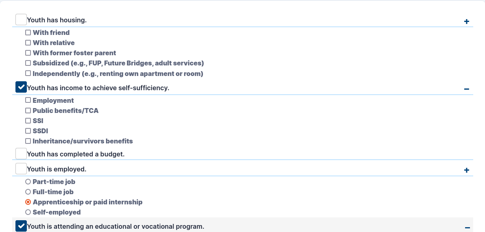
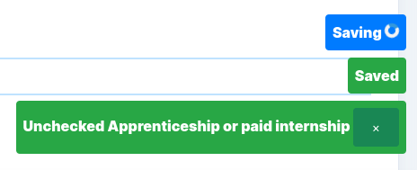

# CASA
## About CASA
CASA or **C**ourt **A**ppointed **S**pecial **A**dvocate is a national nonprofit organization serving children in the foster care system. CASA volunteers help chidren by looking out for the child's best interests while they're in the foster care program. Some examples of what CASA volunteers do include making sure their youth has all their identifying documents and making sure their youth has permanent family or other adult connections.
  
## About the App
This casa app is maintained by volunteers from the [RubyForGood](https://rubyforgood.org/) community. RubyForGood maintains this app with the goal of saving money for CASA organizations so it does not charge for app features if it can help it. It serves about 100-200 monthly users across 4 counties in Maryland.  

[:octicons-mark-github-16: Github repo here](https://github.com/rubyforgood/casa)  
  
### App Summary
The primary functions of this app are to  

 - record work done by the volunteer
 - remind volunteers about upcoming deadlines for tasks
 - generate reports from data stored in the app
 - allow monitoring of cases and volunteers by supervisors

App Specific Terminology

 - **casa case** represents a youth
 - **case contact** represents time spent working on a case. Typically involves contacting a person
 - **emancipaton** the transitioning process for a youth leaving the CASA program
 - **transition** a youth transitioning out of the CASA program

### App Archetecture
#### Backend
The main framework for RubyForGood's CASA is ruby on rails. Some major rails dependencies that define the app are:

 - [:octicons-mark-github-16: devise](https://github.com/heartcombo/devise) for all our authentication needs
 - [:octicons-mark-github-16: pundit](https://github.com/varvet/pundit) for controlling access to data
 - [twilio](https://www.twilio.com/) for SMS messaging
 - [rspec](https://rspec.info/) for unit tests
 - [:octicons-mark-github-16: capybara](https://github.com/teamcapybara/capybara) for system tests

 [Postgres](https://www.postgresql.org/) is our database management system.

#### Hosting
The app is hosted on [Heroku](https://dashboard.heroku.com). Heroku's built in Github integration is used for our QA(quality assurance) environment meaning our QA envirnment contains the latest changes from the main branch of our repository on github. From the Herkou dashboard the production environment can be manually updated to match QA.

#### Frontend
CASA is a multi page website with [AJAX](https://en.wikipedia.org/wiki/Ajax_(programming)) mixed in. CASA's main javascript framework is [jQuery](https://jquery.com/). [Sass](https://sass-lang.com/) is used to organize css. We use the [plainadmin theme](https://plainadmin.com/) which is built on top of bootstrap 5. Using this theme allows the app to be mobile friendly.  
  
CASA is a [progressive web app](https://web.dev/what-are-pwas/) and has an android app as a [trusted web activity](https://developer.chrome.com/docs/android/trusted-web-activity/). This means the website can have app like features like offline mode without having to be remade as an app.

## My CASA Contributions

### Code Contributions

#### Emancipation Checklist
As children leave the CASA program(typically from getting older), CASA volunteers need to make sure their youth(s) are prepared for life. There is a lot to keep track of over a long period of time so they need a checklist to keep track.  

<figure markdown>
  { style="width: 40em" }
  <figcaption>A screenshot of the emancipation checklist as it looks currently</figcaption>
</figure>

The items in the list are stored in the database. The main items like "Youth has housing." are "emancipation categories" and the subitems like "With friend" are "emancipation options". When a user selects a category or option, an association is made between the casa case and the checklist item.  
  
Unlike most of the site, this feature relies on AJAX to save to the database. When a checkbox is clicked, it is disabled until there is a reponse. If the repsonse is successful, the check item is reenabled. If it is unsuccessful, the checkbox is reenabled and reverted to the state it was in before it was checked. An async notifier in the bottom right of the screen displays asynchronous events to the user like waiting for the request and success and error responses.

<figure markdown>
  { style="width: 40em" }
  <figcaption>Here the async notifier is displaying a request completed successfully, a different request is in progress, and the result of the successful request.</figcaption>
</figure>

The concept of a checklist layout wasn't my design. I wanted to go for something more like a kanban board beacuse more websites use that UI to address a problem like this. I also wanted notes for emanipation categories so users could see why certain items are stuck or not possible to achieve.

#### Javascript Disabled Warning

 - QA
 - Client Side
#### Fixed Overlooked Code After Soft Deletes were Implemented
For reports and record keeping all casa cases and case assignments needed to be stored so instead of deleted, so instead of deleting casa cases they are marked as inactive and case assignemnts are marked as unassigned. Some sections of code did not support the new changes. The bugs were:

 - A user's list of case contacts included deactivated and unassigned cases
 - Volunteers would be emailed about court reports regarding cases they have been unassigned from
 - A volunteer's list of recently contacted cases included inactive and unasigned cases
 - Checking whether a volunteer contacted all their cases in 2 weeks included inactive and unassigned cases
 - Checking whether a volunteer is assigned to a tranitioning case included inactive and unassigned cases
 - Inactive and unassigned cases were used in computing the list of volunteers assigned to transitioning cases

#### Created Scripts for [git Hooks](https://git-scm.com/book/en/v2/Customizing-Git-Git-Hooks)
These scripts can update the project locally beyond what git alone is capable of. When used in git hooks this can create a seamless development experience saving time and eliminating errors related to an incorrectly configured project.
The scripts are:

 - **build-assets** compiles css and js
 - **lint** runs linters for javascript erb and ruby
 - **migrate-all** runs [migrations](https://guides.rubyonrails.org/active_record_migrations.html) if any are down
 - **update-dependences** installs dependencies if not already installed
 - **update-branch** updates the local main branch. If on a branch other than main, the branch's commits are rebased on top of main

### Other Contributions
#### Weekly Deploy
At the time of this writing I have done 85 of 151 deploys
#### Helping Contributors
