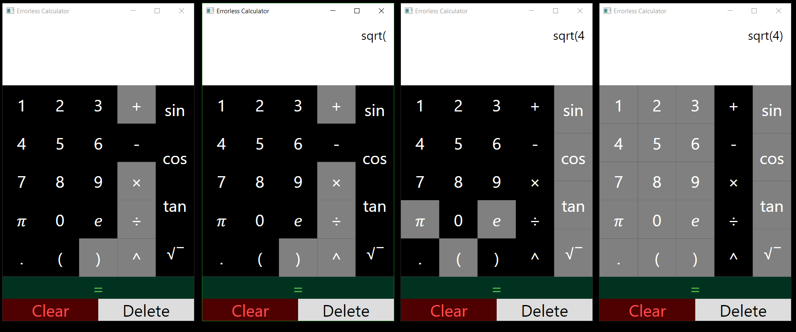
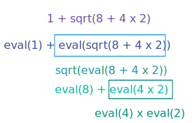
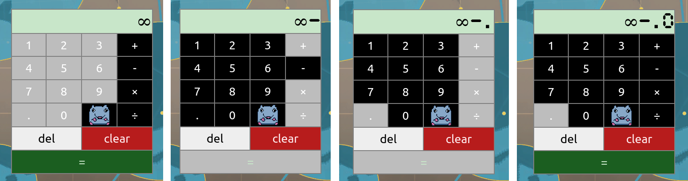

# Error Free Calculator
A calculator that disables buttons that would result in errors

## C# Version
The first version.  
[:octicons-mark-github-16: Repo here](https://github.com/FireLemons/ErrorFreeCalculator)  
  

This calculator achieves evauluation by passing subsections of the expression recursively through the evaluation function  
<figure markdown>
  { style="width: 40em" }
  <figcaption>Example Recursive Call Expansion for an Expression</figcaption>
</figure>

## React Version
[:octicons-mark-github-16: Repo here](https://github.com/FireLemons/ErrorFreeCalculatorReact)  
[:fontawesome-solid-calculator: See It Live Here](https://firelemons.github.io/ErrorFreeCalculatorReact/)  
  

### Notable Differences from the C# Version  
 - Evaluation button support prevents users from evaulating when the expression ends in an operator
 - Uses the [shunting yard algorithm](https://en.wikipedia.org/wiki/Shunting_yard_algorithm) eliminating the stack overhead from the recursive method
 - The expression is actually stored in reverse as part of a hack to make the newest character appear on the right while keeping the expression right aligned.
 - Supports infinity because javascript supports infinity. Try 1 / 0
 - No support for parentheses or functions. Might be added later
 - Rat  
  
### Built With
[{ style="height: 100px" }](https://sass-lang.com/)  
  
[{ style="height: 100px" }](https://reactjs.org/)  
  
[{ style="height: 100px" }](https://www.typescriptlang.org/)