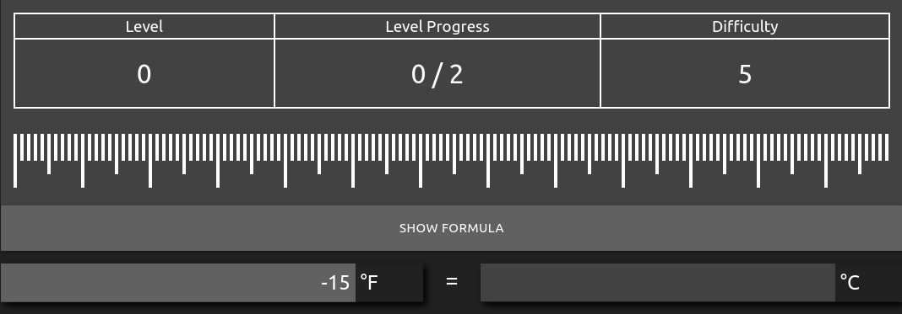
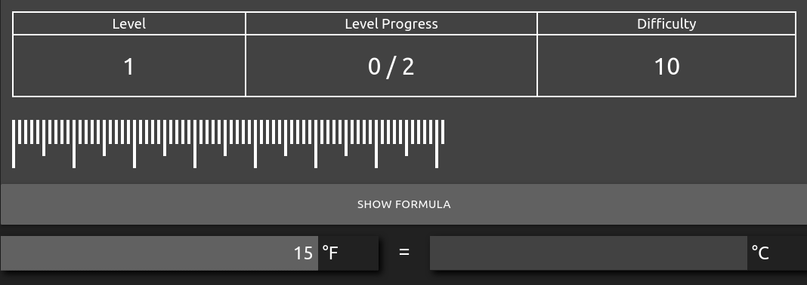
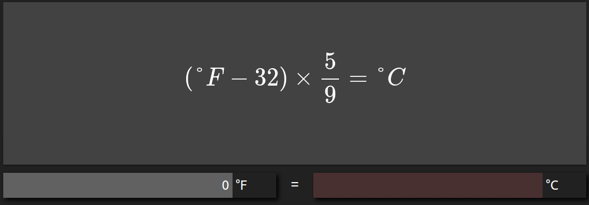
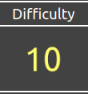
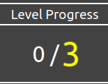
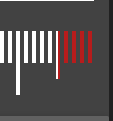
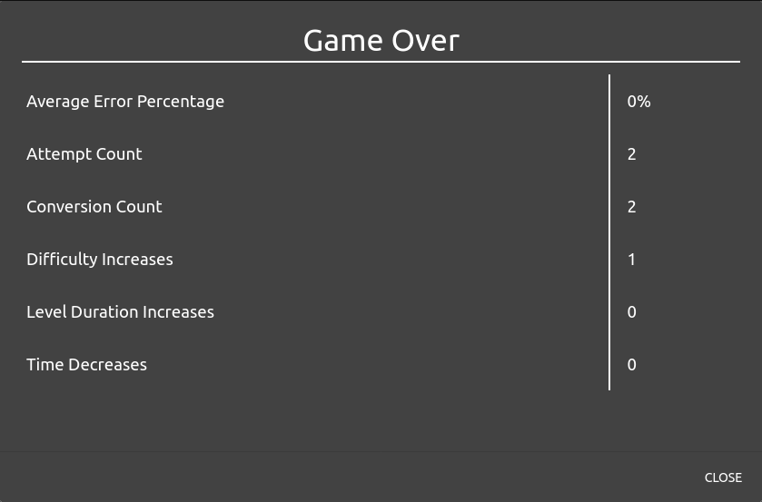
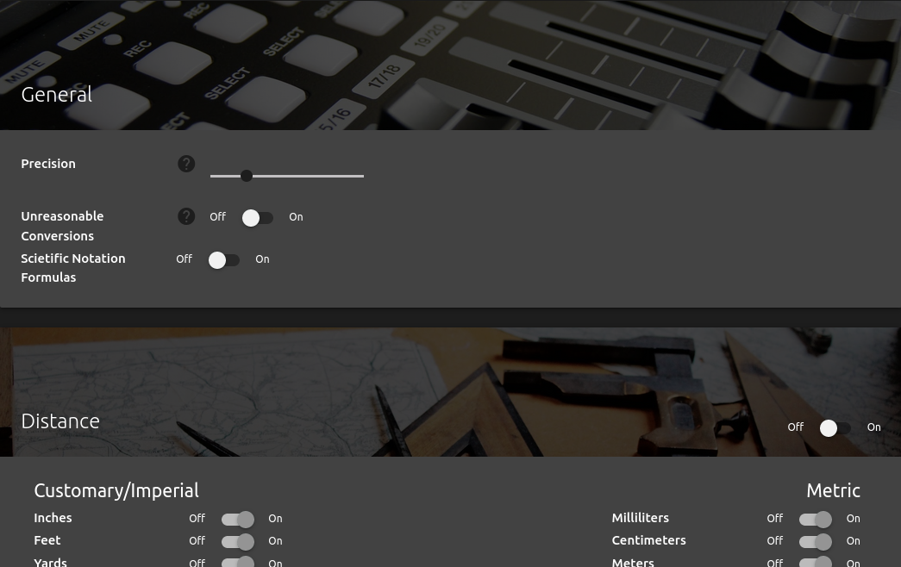

# To Metric

A game for developing the ability to estimate the metric equivalent of a customary unit.  
  
[Play Here](https://firelemons.github.io/ToMetric/)  
[Repo Here](https://github.com/FireLemons/ToMetric)

## Gameplay
Players are given a customary unit to convert into metric units  
If the guess is within 10% of the correct answer, the player progresses  
  
  
  

After the first 2 problems are solved, the game begins and the time starts counting down

  
  
  
The conversion formula can be shown at the cost of a few seconds  
No guesses can be entered while the formula is visible  
  
  
  

When levels are beaten, the problem difficulty, level length, and level time may change to make the game harder  
  
{ style="height: 64px" }
{ style="height: 64px" }
{ style="height: 64px" }
  

After the game is lost, a summary of the player's progress is displayed  
  
  
  
## Options  
Players can choose here  

  * what type units to convert  
  * the correct answer precision threshold  
  * whether to display formulas in scientific notation
  * whether to include conversions where the units are very different in magnitude  
  
  

## Built With
[{ style="height: 100px" }](https://vuejs.org/)
[{ style="height: 100px" }](https://vuejs.org/)
[{ style="height: 100px" }](https://materializecss.com/)  